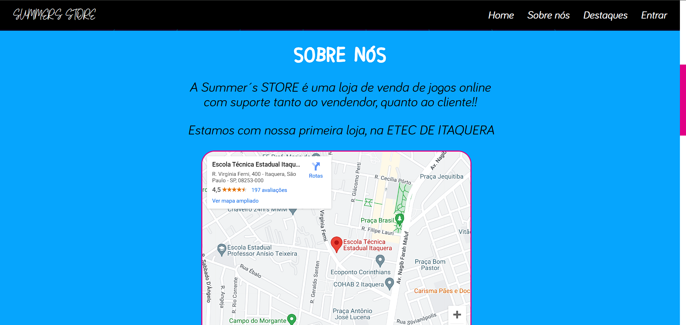
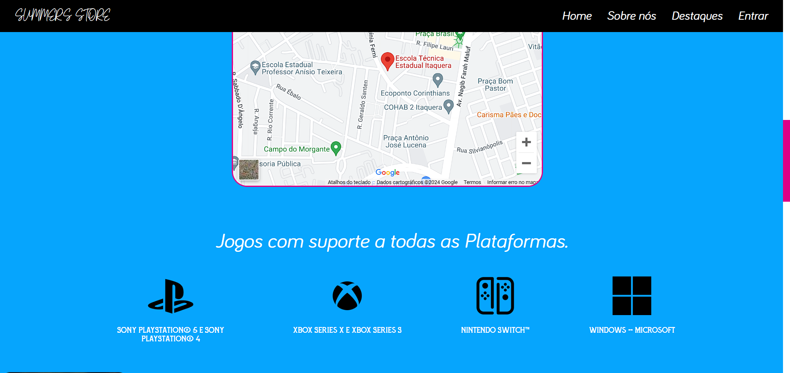
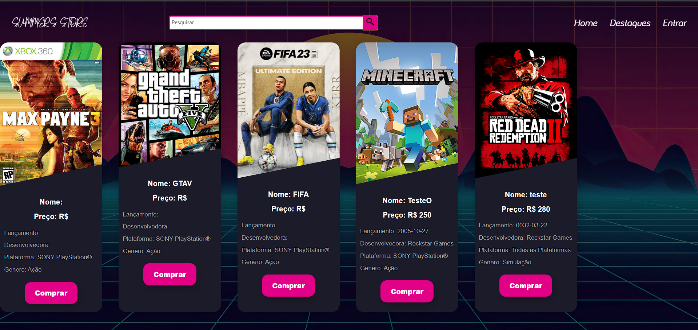
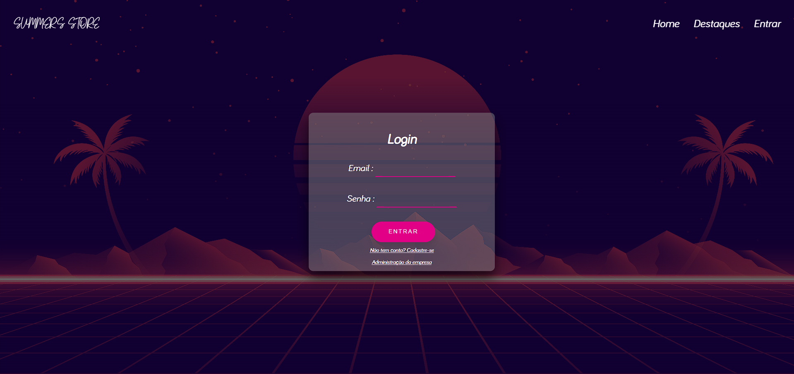
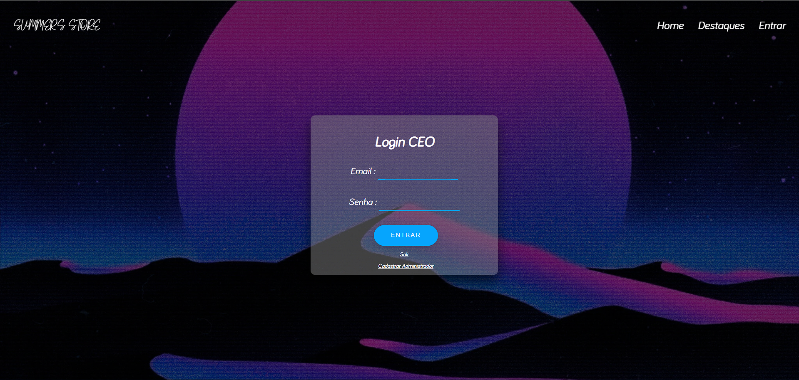
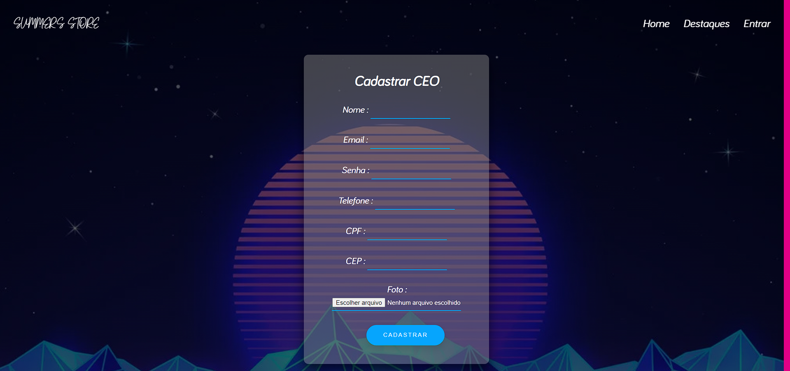

# Projeto CRUD em PHP - SummerStore -Harison Rios 💻

> Projeto CRUD em PHP SummerStore - LandingPage

> Projeto CRUD em PHP SummerStore - LandingPage2

> Projeto CRUD em PHP SummerStore - LandingPage3

> Projeto CRUD em PHP SummerStore - Produtos

> Projeto CRUD em PHP SummerStore - Login User

> Projeto CRUD em PHP SummerStore - Cadastro User

> Projeto CRUD em PHP SummerStore - Login Adm

> Projeto CRUD em PHP SummerStore - Cadastro Adm

## Comentários 

Projeto que foi desenvolvido, durante o ensino técnico na ETEC de Itaquera, sendo trabalho final para a matéria de Programação WEB 2.
Esse projeto ainda não esta 100% concluido

## Tecnologias

      
 
## 📝 Licença

Esse projeto está sob licença. Veja o arquivo [LICENÇA](LICENSE.md) para mais detalhes.
